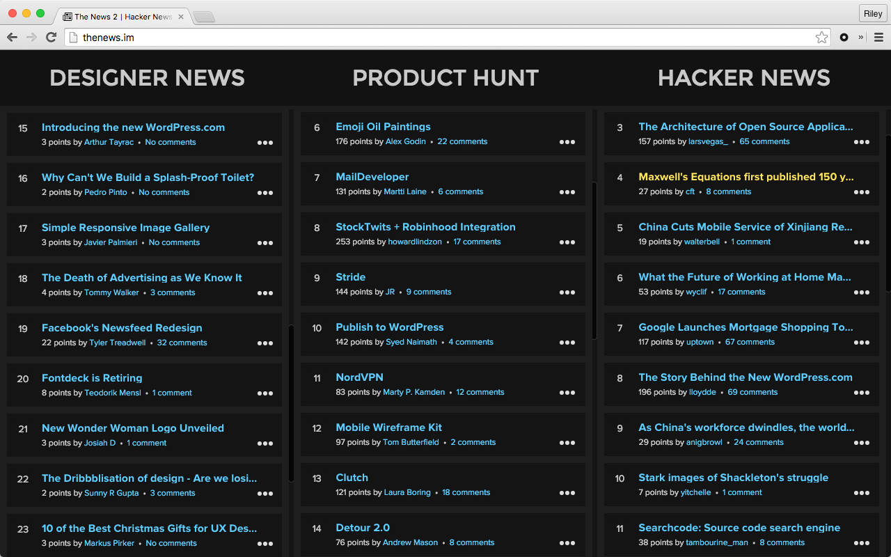

# Dark Theme Everywhere

**_Darkens bright pages for easier nighttime reading. Check it out on the [Chrome Web Store](https://chrome.google.com/webstore/detail/dark-theme-everywhere/nibjplbnmmklkfnkpecgbffkifmdbjed)._**

Unofficial improvement of the [unofficial improvement](https://chrome.google.com/webstore/detail/nicer-inverter/oichlckdgnbjkmhaebnnhibamjgpndkm) of Inverter. I was tempted to call this "Nicest Inverter", but it doesn't actually invert anything. It gives you a dark page, no matter what!

**Before:**

**After:**

Improvements from _Nicer Inverter_:
 - Dark-ifies pages aggressively, so you're much less likely to come across pages with bright patches.
 - Dark-ifies pages _by default_, so you don't need to click the extension's button on every page load.
 - Allows you to toggle dark styles on and off without reloading the page.

There are a lot of inverters out there, and many of them are great. I'm using [Dark Reader](https://chrome.google.com/webstore/detail/dark-reader/eimadpbcbfnmbkopoojfekhnkhdbieeh) right now, and honestly, it's better than this for most use cases. BUT! Some pages on the internet are dark by default. When you invert a dark page, it becomes light. AGH MY EYES! This extension will _always_ give you a dark background.

You can toggle the theme with a hotkey by going to Tools -> Extensions and clicking the "Keyboard shortcuts" link at the bottom.

Now that your browser is nice and dark-themed, you might notice an annoying white flash between pages. It's a known bug that's being tracked in [Issue 1373](https://code.google.com/p/chromium/issues/detail?id=1373) and [Issue 126341](https://code.google.com/p/chromium/issues/detail?id=126341). I wrote [another extension](https://chrome.google.com/webstore/detail/reduce-background-flicker/hdnedegfdlmgbabbgmnjnmmijfjeaiib) to reduce the flicker, but the problem will exist to some degree until it's fixed in Chromium.

_Enjoy!_

Licensed under [MIT](./LICENSE.md).
